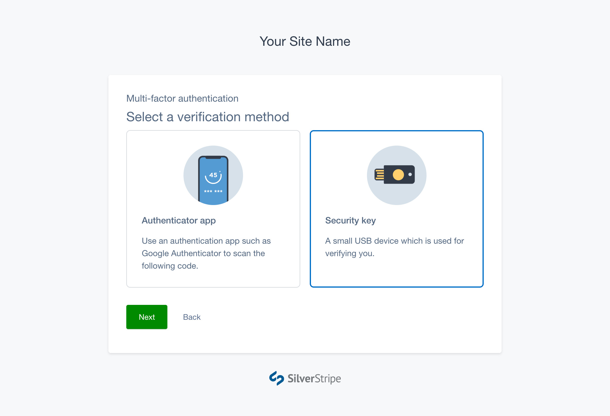
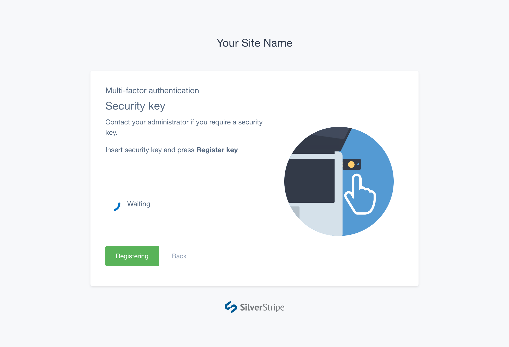
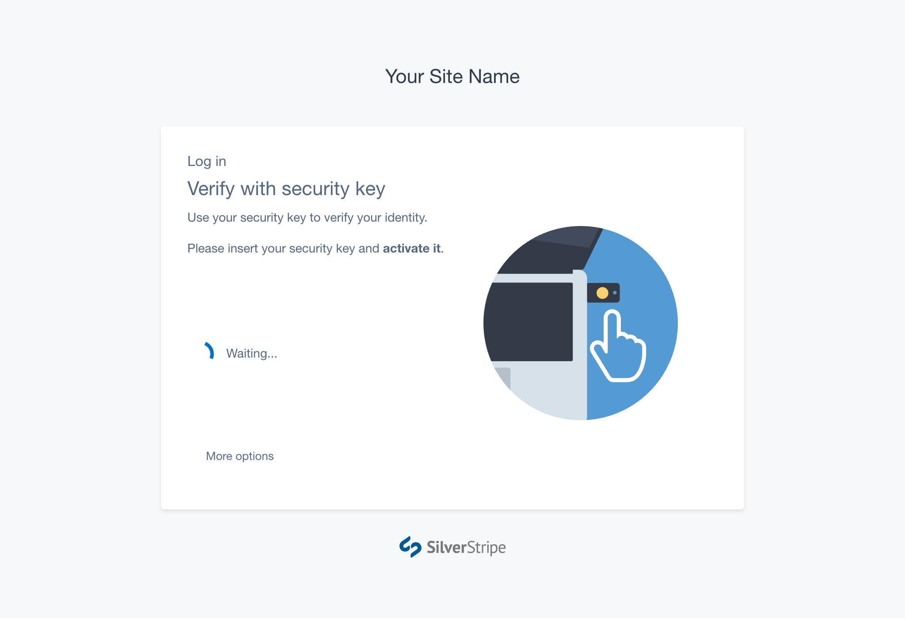
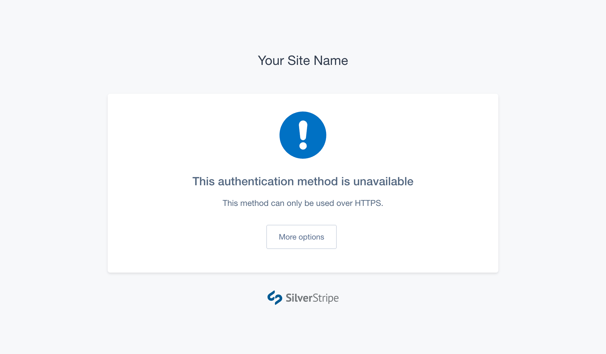

# Using security keys

## Requirements

Before you can setup MFA on your account you’ll need a compatible security key
that supports the WebAuthn standard. Some examples:

- Yubico Yubikey 5 series
- Yubico Yubikey 4 series
- Google Titan Key

You must use a browser that supports the WebAuthn standard:

- Chrome 70+
- Edge 18+
- Firefox 60+
- Safari 13+

You must also log in via **HTTPS**. If there is no padlock in the address bar
of your browser, try changing `http://` to `https://` at the beginning of the
address.

[notice]
Security keys are not recommended for use with Subsites. If you intend to log in to a Subsite over a different website domain to your main site, your security key will not be compatible. This is an intentional security requirement of the WebAuthn standard.
[/notice]

## Setting up with a security key

Enter the MFA setup process. Pick **Security key** from the Select Method
screen, and press **Next**.

Insert your security key into a USB port and press **Register key**.

Then, activate your security key. This is generally done by tapping the gold
area or button in the centre of the key.

Once you see the message _Key verified_, press **Complete registration** to
finish registering the key with your account.

If you see an error during this process, try reinserting your security key and
pressing **Retry**.

## Logging in using a security key

Login to your SilverStripe CMS account with your email and password. You’ll then
be prompted to activate your security key.

Insert your security key into a USB port on your computer and activate it. Once
the key is verified, you will be automatically directed to the CMS.

If you see an 'unavailable' message like the one below, make sure you are using
a supported browser and that you are connecting to the site over HTTPS.

