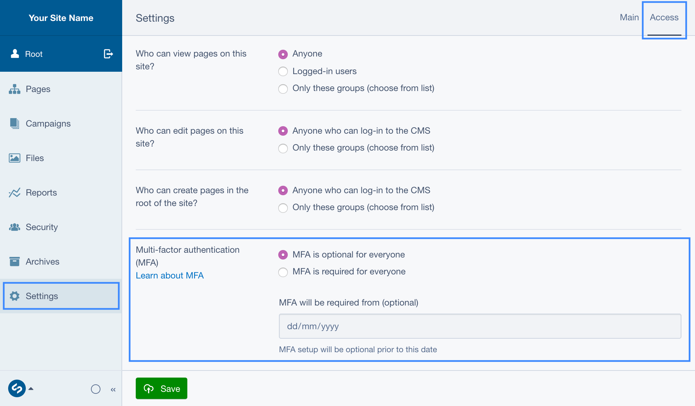

# Configuring MFA for your site

To modify your site's MFA configuration, navigate to the **Settings** section,
and select the **Access** tab.

Here, you can select one of two modes of operation for MFA on your site:

## MFA is optional for everyone (default)

This is the default setting when MFA is installed. Everyone will be prompted to
set up multi-factor authentication upon their first login, but they can skip the
setup process and continue to log in as they did before. They will be able to
set up MFA later via their Profile page in the CMS.

## MFA is required for everyone

Everyone without MFA setup will be prompted with a message requiring them to
setup MFA when they attempt to log in. If they choose not to proceed with setup,
they will remain logged out.

Once a user has set up an MFA method on their account, they will not be able to
remove it unless they have added another.

[hint]
**Set a date.**

As an administrator, you can set the date for when MFA will be become mandatory.
MFA will be optional before this date, however users without MFA configured will
be prompted with the option to set it up on every login, until MFA is set up.

[/hint]
